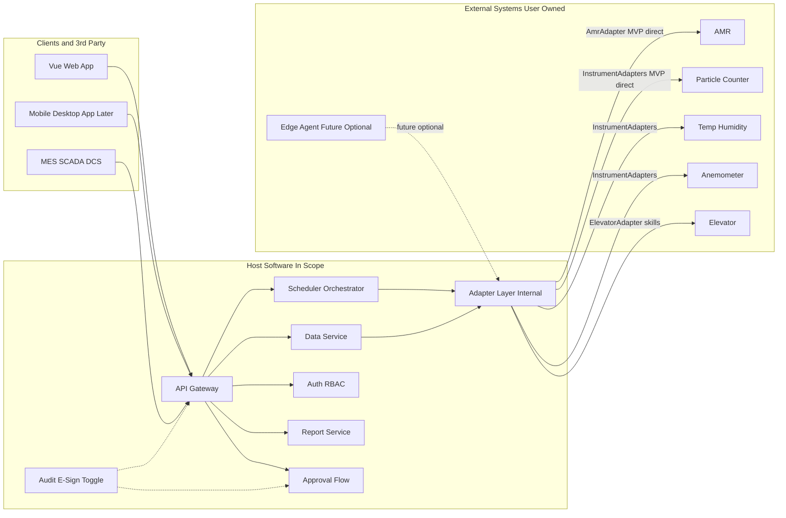
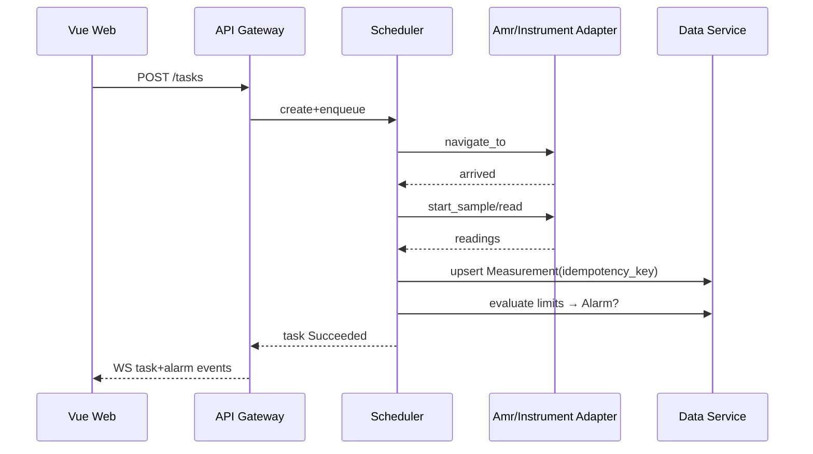
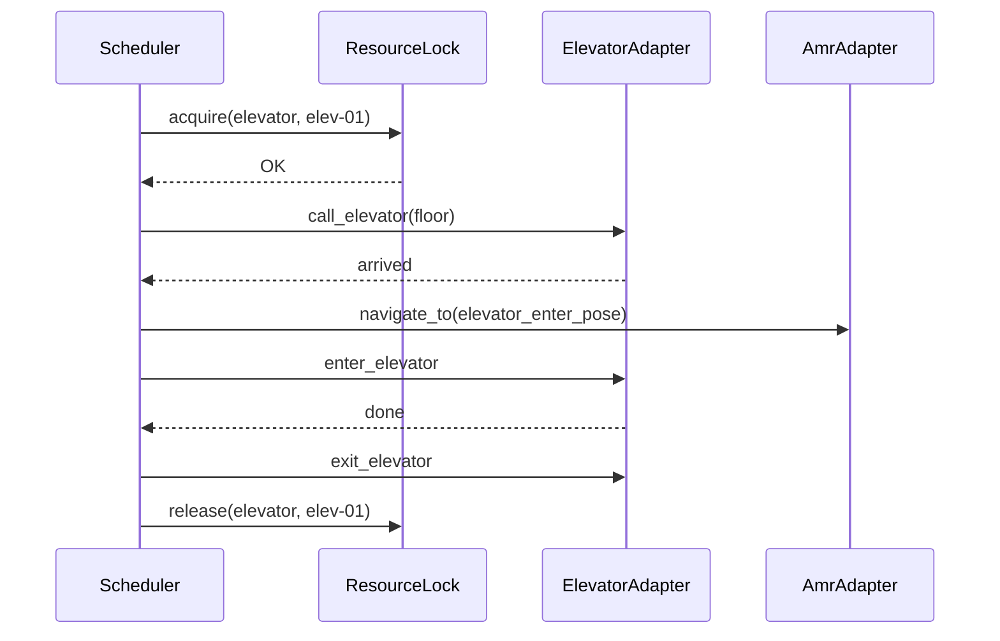
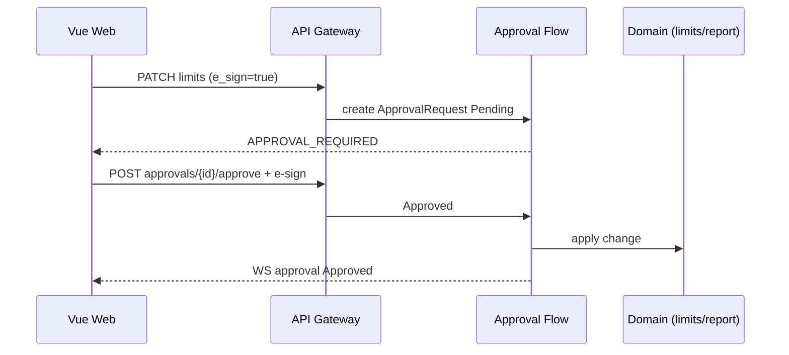

# 设计规范（DS）— 移动环境监测机器人上位机软件

| 项 | 内容 |
|----|------|
| 文档编号 | MER-DS-001 |
| 版本 | V0.4 |
| 日期 | 2026-09-25 |
| 作者 | PM_Max |
| 状态 | Draft |
| 范围 | **上位机软件架构与模块**；机器人/仪表为边界外 External Systems |
| 依据 | `doc/spec/urs.md` V0.3；`ref/requirement.md`；`spec/tech_stack.md`；`spec/interface_contracts.md`；`spec/security.md`；`spec/observability.md` |
| 关联方案 | `ref/project_scheme.md` V0.4 |
| 权威声明 | **里程碑以 `ref/plan.md` §1.2 为准**（本文不另定义里程碑语义）；**仓库目录以 scheme §4.2 为准**（`backend/app/adapters/`） |

---

## 1. 文档信息与设计目标

本 DS 将 URS（上位机范围）落实为可实施的软件架构与模块边界。设计原则：

- 单体模块化，避免过早微服务。
- 业务只依赖抽象接口；设备/DB 经适配层；**不绑定具体硬件品牌**。
- **对外**统一经 **API Gateway**；**对内**设备经适配层：**MVP 直连**；未来可扩展边端代理（须端侧缓存）。
- **电梯**：独立 **ElevatorAdapter**（ElevatorFake / ElevatorVendorX）；调度编排调用其技能；**AmrAdapter 不挂** call/enter/exit_elevator。
- 配置外置（YAML）；密钥走环境变量。
- Fake/Simulator 一等公民，保障无硬件开发与 CI（含电梯 Fake）。
- 审计追踪与电子签名为**可开关**横切能力；**签名开启时强制批准流**。
- 多机 MVP：**简单互斥**（资源锁含点位/电梯/充电桩/区域）；交通管制增强为演进项。
- 硬件选型、改装、现场基建由用户负责；本设计仅定义集成契约与软件模块。

---

## 2. 系统上下文与部署视图

### 2.1 上下文（对外 Gateway vs 对内适配）

- **操作员 / Vue Web / 后续桌面·移动客户端** ↔ **API Gateway** ↔ 调度 / 数据 / 鉴权 / 报表 / 批准流
- **第三方系统**（MES、SCADA、DCS 等）↔ **API Gateway**
- **适配层（对内）** ↔ **External Systems**（AMR、粒子、温湿度、风速、**电梯**、扩展浮游菌、远期臂/相机）
- **直连（MVP）**：仪表独立联网，适配层直接通讯，不上边端代理
- **边端代理（未来）**：须端侧数据缓存；非 MVP

> **职责区分**：API Gateway = **对外**统一入口；适配层 = **对内**设备接入。二者不可混用。  
> **电梯**：经 **ElevatorAdapter** 接入；与 AmrAdapter 并列，由调度编排调用。

### 2.2 部署（软件在边界内）

```text
======== In Scope: Host Software ========
[Ubuntu 服务器]
  - mer-gateway / API Gateway（对外统一入口，OpenAPI）
  - mer-api / 领域服务（调度、数据、鉴权、报表、批准流）
  - mer-worker（可选）
  - mer-adapter-gateway（对内适配层：Amr/Instrument/Elevator/...）
  - PostgreSQL / SQLite(开发) + 时序（MVP=PG 分区）
  - 反向代理 (Nginx)；TLS 按现场（见 scheme 部署安全）
[客户端]
  - Vue Web（TypeScript + Vue，MVP）→ 经 API Gateway；实时通道=WebSocket
  - 桌面/移动（分期）→ 经 API Gateway
==========================================

======== External Systems（用户负责）========
  - AMR × N + 充电桩
  - 仪表（MVP 直连）
  - 电梯/楼控（经 ElevatorAdapter）
==========================================
```

### 2.3 架构图（含 API Gateway 与 ElevatorAdapter）



---

## 3. 逻辑架构（分层）

| 层/模块 | 职责 |
|---------|------|
| **API Gateway（对外）** | 统一入口、鉴权、限流、OpenAPI、路由；服务 MES/SCADA/DCS 与前端 |
| API / 领域服务 | REST、**WebSocket** 遥测推送、统一错误模型 |
| 鉴权与 RBAC | 用户/组/权限、会话、API Token |
| 调度编排引擎 | 技能/任务/组合/集群状态机、**简单互斥**资源锁（含电梯）、重试；**调用 ElevatorAdapter 技能** |
| 数据服务 | 点位、时序监测数据、限值、查询聚合、幂等 Upsert |
| 报警事件 | 规则引擎、生命周期、**WebSocket** 实时通知 + 历史查询 |
| 报表 | 批报告（先 HTML 归档，PDF 演进） |
| 批准流 | 与电子签名绑定；签名开启时强制 |
| **适配层（对内）** | 设备注册、适配器工厂；Amr / Instrument / **Elevator**；MVP 直连 |
| 审计/电子签名 | 开关；开启签名 → 批准流 + 签名挑战 |
| 备份 | PostgreSQL + config/ + 报告目录 |
| 前端 | 地图、任务、看板、报警、配置、用户、批准中心（经 Gateway） |

---

## 4. 关键模块与接口边界

### 4.1 适配器接口方法清单（不绑定品牌）

```text
AmrAdapter:                    # 仅导航/充电/遥测/急停相关；不含电梯
  connect() / disconnect()
  get_status() -> RobotStatus  # 必含 estop/fault_code/fault_msg/mode
  navigate_to(pose | point_id, options?) -> CommandHandle
  cancel(command_id?)
  dock_charge() -> CommandHandle
  subscribe_telemetry(callback) / unsubscribe

ElevatorAdapter:               # 独立；调度编排调用
  connect() / disconnect()
  get_status() -> ElevatorStatus
  call_elevator(floor, options?) -> CommandHandle
  enter_elevator(options?) -> CommandHandle
  exit_elevator(options?) -> CommandHandle
  # 实现：ElevatorFake / ElevatorVendorX

ParticleAdapter:
  connect() / disconnect()
  start_sample(params) / stop_sample()
  read_channels() -> ChannelReading[]

ClimateAdapter:
  connect() / disconnect()
  read_temp_humidity() -> TempHumidityReading

AirflowAdapter:
  connect() / disconnect()
  read_air_speed() -> AirSpeedReading

# 扩展 / 远期占位
ViableAdapter, ArmAdapter, DepthCameraAdapter
```

公共约定：

- 生命周期：`start` / `stop` / `health`
- 错误：映射为领域错误（`retryable` 标记）
- 坐标系与单位在适配器边界转换为领域单位
- 业务编排**禁止**直接出现厂商私有帧、寄存器地址
- 仪表拓扑：MVP `access_mode: direct`；预留 `via_edge_agent`
- **电梯资源锁**：执行 Call/Enter/Exit 前须 `acquire(elevator, id)`（见 scheme §5.1）

#### 4.1.1 RobotStatus 急停/故障契约（DS-004）

| 字段 | 类型 | 说明 |
|------|------|------|
| `estop` | bool | 急停激活 |
| `fault_code` | string\|null | 故障码 |
| `fault_msg` | string\|null | 故障描述 |
| `mode` | enum | `idle` / `running` / `charging` / `fault` / `estop` 等 |
| `battery_pct` | number? | 电量 |
| `pose` | Pose? | 位姿 |
| `online` | bool | 会话在线 |

**Fake 注入**：`AmrFake.inject(estop=True | fault_code=...)`。  
**调度策略**：检测到 `estop=true` 或 `mode=estop|fault` → **中断当前任务**为 `Failed`（原因码 `ESTOP`/`FAULT`），释放已持资源锁；产生报警事件。不可在急停状态下继续下发导航/采样。

### 4.2 API Gateway / OpenAPI — MVP 最小资源表（DS-006）

对外统一前缀 `/api/v1/...`（经 Gateway）。错误体：`{ "code", "message", "retryable", "details?" }`。  
**禁止**客户端/第三方绕过 Gateway。破坏性变更走 `/api/v2`。

| 方法 | 路径前缀 | 分组 | 权限码（示例） |
|------|----------|------|----------------|
| POST | `/api/v1/auth/login` | operations | `public` |
| GET/POST | `/api/v1/tasks` | operations | `operations.task.read/write` |
| POST | `/api/v1/tasks/{id}/cancel` | operations | `operations.task.write` |
| GET/POST/PATCH/DELETE | `/api/v1/points` | settings | `settings.point.*` |
| GET | `/api/v1/measurements` | data | `data.measurement.read` |
| GET | `/api/v1/alarms` | data | `data.alarm.read` |
| POST | `/api/v1/alarms/{id}/ack` | operations | `operations.alarm.ack` |
| POST | `/api/v1/alarms/{id}/close` | operations | `operations.alarm.close` |
| GET | `/api/v1/alarms/export` | data | `data.alarm.export` |
| GET/POST | `/api/v1/reports` | data | `data.report.read/write` |
| GET/POST | `/api/v1/approvals` | operations | `operations.approval.*` |
| GET/PATCH | `/api/v1/settings/limits` | settings | `settings.limit.*`（签名开则经批准流） |
| GET/POST | `/api/v1/users` | settings | `settings.user.*` |
| GET | `/api/v1/robots` | data | `data.robot.read` |
| GET | `/api/v1/maps` | data | `data.map.read` |
| WS | `/api/v1/ws` | — | 鉴权后订阅 `pose`/`task`/`alarm`/`measurement` |

**错误码初稿**：

| code | 含义 | retryable |
|------|------|-----------|
| `AUTH_REQUIRED` | 未鉴权 | false |
| `FORBIDDEN` | 无权限 | false |
| `VALIDATION_ERROR` | 参数错 | false |
| `NOT_FOUND` | 资源不存在 | false |
| `CONFLICT_MUTEX` | 资源锁冲突（且策略=fail） | true |
| `DEVICE_OFFLINE` | 设备离线 | true |
| `DEVICE_ESTOP` | 急停中 | false |
| `APPROVAL_REQUIRED` | 需批准 | false |
| `APPROVAL_REJECTED` | 已驳回 | false |
| `IDEMPOTENCY_REPLAY` | 重复上报已忽略 | false |
| `RATE_LIMITED` | 限流 | true |
| `INTERNAL_ERROR` | 内部错误 | true |

### 4.3 实时通道（DS-011）

- **MVP 锁定 WebSocket**（位姿、任务进度、报警、测量推送）。
- SSE 列入扩展，不双实现。
- 心跳与重连；按订阅主题过滤。

---

## 5. 数据模型概要

| 实体 | 关键字段（逻辑） |
|------|------------------|
| Robot | id, name, adapter_type, config_ref, status(RobotStatus), last_pose, map_id |
| Elevator | id, adapter_type, config_ref, floors, status |
| Map | id, name, source, layers_meta |
| Point / MonitoringSite | id, map_id, name, pose, instrument_profile, limits |
| SkillDef | id, type, params_schema（含电梯技能，实现绑定 ElevatorAdapter） |
| TaskDef / TaskInstance | 定义与实例；状态机；robot_id；skill 序列 |
| CompositeJob / ClusterJob | 子任务图；触发器 |
| ResourceLock | resource_type(`point`\|`elevator`\|`charger`\|`zone`)/id, holder, expires_at |
| Measurement | id, task_id, point_id, robot_id, metric, value, unit, ts, quality, **idempotency_key** |
| Alarm | id, rule_id, severity, state, ack_by, ts |
| User / Group / Role | RBAC |
| AuditEvent | actor, action, object, before/after, ts, request_id；**只追加** |
| ESignRecord | user, meaning, object_ref, ts, method |
| ApprovalRequest / ApprovalStep | object_ref, state, approvers, expires_at |
| Report | task_ref, file_uri, format(`html`\|`pdf`), generated_at |
| BackupSet | uri, created_at, scope(`postgres`+`config`+`reports`) |
| DeviceConfig | YAML；含 robots/instruments/**elevators**/access_mode |

### 5.1 Measurement idempotency_key（DS-007）

| 规则 | 说明 |
|------|------|
| 生成 | 优先 `client_request_id`（若上报方提供）；否则 `sha1(device_id + '|' + sample_id + '|' + ts_iso)` |
| 唯一约束 | DB UNIQUE(`idempotency_key`) |
| 重复上报 | Upsert：**忽略**重复（保留首次 good）；返回成功+`IDEMPOTENCY_REPLAY` 标记 |
| 任务关联 | Measurement.task_id 可空（补传场景）；有则校验点位属于该任务 |

### 5.2 时序存储决策门槛（DS-013）

- **MVP**：PostgreSQL 分区表（按月）。
- **触发评估 Timescale**（保留其一即可启动评估）：保留期 **> 18 个月**，或持续写入 **QPS > 200**，或历史趋势查询 P95 **> 2s**（试点基线采集后冻结阈值）。

物理库：关系型为主；迁移版本化。

---

## 6. 任务 / 技能编排模型

```text
原子技能 Skill → 任务 Task（有序技能列表 + 失败策略）
              → 组合任务 Composite（顺序 / 等待时间 / 等待事件）
              → 集群 Cluster（多 Robot 绑定 + 同步屏障可选）
```

### 6.1 任务状态迁移表（DS-005）

| 从 \ 到 | Queued | Dispatched | Running | Succeeded | Failed | Cancelled |
|---------|--------|------------|---------|-----------|--------|-----------|
| Created | ✓ | | | | | ✓ |
| Queued | | ✓ | | | ✓（互斥 fail/超时） | ✓ |
| Dispatched | | | ✓ | | ✓ | ✓ |
| Running | | | | ✓ | ✓（含急停/设备故障） | ✓ |
| Succeeded/Failed/Cancelled | 终态 | | | | | |

- **暂停**：轻微 TBD（预留 `Paused` 不进 MVP 门禁）。
- **失败回充**：可配置 `on_fail: dock_charge | goto_standby | none`。
- **取消**：释放资源锁；向 AmrAdapter 发 `cancel`（若有在途导航）。

### 6.2 ApprovalRequest 状态机（DS-005）

```text
Draft → Pending → Approved
                → Rejected
                → Expired
```

| 状态 | 说明 |
|------|------|
| Draft | 发起人编辑 |
| Pending | 已提交；等待审批人；可配置超时（默认 72h）→ Expired |
| Approved | 全部必需步骤通过；绑定动作生效（限值变更落库 / 报告标记已批准） |
| Rejected | 任一驳回；动作不生效 |
| Expired | 超时；动作不生效；可重新发起 |

**绑定点**：限值变更、报告批准（可配置扩展）。  
**签名旁路**：`features.e_sign=false` 时，上述动作**直接执行**，不创建 ApprovalRequest（URS-AUD-004）。  
**多人审批**：MVP 单步单人；串行多步为扩展。

### 6.3 资源互斥与电梯

- MVP：点位、**电梯**、充电桩、区域用锁；冲突排队或失败可配置（scheme §5.1）。
- 电梯技能：调度 `acquire(elevator)` → 调用 **ElevatorAdapter** Call/Enter/Exit → `release`。
- 演进：简单互斥 → 交通管制增强 → 远期车队算法。

幂等：下发带 `client_request_id`；设备动作需状态机保护避免重复采样。

---

## 7. 设备适配层设计（对内）

```text
config/devices.yaml
  → AdapterFactory（按 type 装配）
    → AmrFake / AmrGenericHttp / AmrVendorX
    → ParticleFake / ClimateFake / AirflowFake / ...
    → ElevatorFake / ElevatorVendorX     # 独立，与 AMR 并列
DeviceRegistry（健康、能力声明）
access_mode: direct  # MVP；预留 via_edge_agent
elevators: [{id, adapter: elevator_fake, ...}]
```

- 连接、心跳、超时、重连、编解码全部在适配器内。
- 扩展浮游菌/臂：新增适配器 + YAML，不改调度核心。
- **不在本 DS 中给出硬件选型或品牌结论。**

---

## 8. 通信与实时（软件视角）

| 链路 | 设计要点 |
|------|----------|
| 对外 | 客户端/第三方 → API Gateway |
| 指令/遥测（对内） | MVP：适配层 ↔ AMR/仪表/电梯；指令需确认回执 |
| 断点续传 | MVP：适配层重试 + 数据服务幂等 Upsert（§5.1）；未来边端须端侧缓存 |
| 会话监测 | 心跳超时 → `DEVICE_OFFLINE` 事件；任务按策略 Failed 或等待重连（可配置，默认 Failed） |
| 时钟 | NTP 写入部署手册 |
| 实时推送 | **WebSocket**（§4.3） |

---

## 9. 安全、电子签名与批准流

| 能力 | 设计 |
|------|------|
| 认证 | 本地账号（MVP）；LDAP/OIDC 可选后期 |
| 授权 | RBAC；API 与 UI 共用权限码；Gateway 强制鉴权 |
| 审计开关 | `features.audit_trail: true/false` |
| 电子签名开关 | `features.e_sign: true/false`；**建议默认 false** |
| 签名与批准流 | **e_sign=true 时强制进入批准流**（§6.2） |
| 典型绑定动作 | 报告批准、限值变更 |
| 审计存储 | **只追加表**；应用层禁止 UPDATE/DELETE；DB 角色只授 INSERT+SELECT（URS-AUD-003） |
| 密码/会话 | 配置占位：`security.password_min_len`、`security.session_ttl_min`（细则试点后冻结） |
| 密钥 | `.env` / 密钥管理；禁止入库 |
| 默认 | 鉴权开启；审计/签名建议默认关 |

不声称已通过 Part 11 认证。

---

## 10. 报警通知与备份（DS-008 / DS-009）

### 10.1 报警

- **MVP 通知通道 = WebSocket** 实时推送 + 历史查询/导出（CSV）。
- 确认权限：`operations.alarm.ack`；关闭权限：`operations.alarm.close`。
- 邮件/站内信等列为 Could/扩展。

### 10.2 备份范围（冻结）

| 范围 | 内容 |
|------|------|
| PostgreSQL | 业务库逻辑备份 |
| `config/` | devices/features 等 YAML |
| 报告目录 | 已生成报告文件 |

恢复步骤与校验对齐 **TC-MVP-09**（`plan.md`）。异地拷贝策略轻微 TBD。

---

## 11. 可观测性（DS-003）

对齐 `spec/observability.md`。

### 11.1 结构化日志

| 字段 | 必选 | 说明 |
|------|------|------|
| `ts` | ✓ | ISO8601 UTC |
| `level` | ✓ | DEBUG/INFO/WARN/ERROR |
| `module` | ✓ | 模块名 |
| `request_id` | ✓ | Gateway 注入，全链路贯通 |
| `task_id` | 有则必带 | 任务相关日志 |
| `robot_id` | 有则必带 | |
| `msg` | ✓ | 人类可读 |

**禁止**：密钥、Token、完整原始设备报文。可记摘要哈希/截断。

### 11.2 MVP 最小指标集

| 指标 | 说明 |
|------|------|
| `scheduler.dispatch_latency_ms` | 任务入队到下发 |
| `adapter.command_success_ratio` | 适配器命令成功率（按 type） |
| `adapter.online` | 设备在线数 |
| `queue.task_depth` | 任务队列长度 |
| `mutex.wait_ms` | 资源锁等待 |
| `gateway.request_rate` / `error_rate` | Gateway QPS 与错误率 |

健康检查：`GET /health`、`GET /ready`（见 scheme）。

---

## 12. 多客户端与对外 API

- **API Gateway** 为唯一对外入口；同一契约服务 Vue Web（MVP Must）、桌面/移动（分期）、MES/SCADA/DCS。
- 浏览器：Vue Web（MVP），TypeScript + Vue。
- 能力：常规操作、数据获取、设置类；`api_client` + Token；限流；OpenAPI。

---

## 13. 技术栈落地（推荐）

对齐 `spec/tech_stack.md`（本项目前端选型覆盖默认规范；**不修改**全局 `tech_stack.md`）：

| 层级 | 推荐 | 备注 |
|------|------|------|
| 语言 | Python 3.11+、TypeScript | |
| 后端 | FastAPI | Gateway 可同进程模块或前置 |
| 前端 | Vue 3 + Vite | **已锁定** |
| 包管理 | `uv`、`pnpm`/`npm` | |
| 配置 | YAML + 环境变量 | |
| 架构 | 单体模块化；**目录以 scheme §4.2 为准**（`backend/app/adapters/`，**无**顶层 adapters/） | |
| DB | PostgreSQL（生产）；SQLite 开发 | 时序见 §5.2 |
| 部署 | Ubuntu + systemd 或 Docker Compose | |
| 测试 | pytest + 前端单测；Fake（含 ElevatorFake）；HIL 跳过 CI | |

---

## 14. 关键业务时序（DS-012）

### 14.1 任务主路径



### 14.2 电梯 Call/Enter/Exit



### 14.3 批准流（签名开启）



---

## 15. 风险与设计点状态（上位机）

| 项 | 说明 | 状态 |
|----|------|------|
| 边端代理 vs 直连 | MVP=直连；未来可选边端（须端侧缓存） | **已决议** |
| 电梯适配模型 | **独立 ElevatorAdapter**；AmrAdapter 不挂电梯方法 | **已决议（V0.4）** |
| 多机交通管制 | MVP 简单互斥（含电梯锁） | **已决议** |
| API Gateway | 必须；操作/数据/设置 | **已决议** |
| 电子签名批准流 | 可开/关；开启强制；建议默认关 | **已决议** |
| 前端 / 实时通道 | Vue；**WebSocket** | **已决议** |
| 里程碑权威 | plan.md §1.2 | **已决议（V0.4）** |
| 目录权威 | scheme §4.2 | **已决议（V0.4）** |
| 地图中间表示 | 厂商专有 → 标准化显示层 | 轻微 TBD |
| 时序存储 | MVP PG 分区；门槛见 §5.2 | 轻微 TBD（有门槛） |
| PDF 引擎 | HTML 先归档 | 轻微 TBD |
| 用户设备 API | 阻塞真机联调，不阻塞 Fake | 外部依赖 |

---

## 附录 A：URS Must → 模块/接口/实体追溯（DS-002）

> 覆盖 URS V0.3 全部 **MVP Must**（45 条）。状态：`已设计` / `部分` / `TBD`。

| URS ID | 模块 / 接口 / 实体 | 状态 | 备注 |
|--------|-------------------|------|------|
| URS-ROB-001 | AdapterFactory；Robot；devices.yaml robots[] | 已设计 | Fake↔真实切换零改编排 |
| URS-ROB-002 | AmrAdapter.navigate_to；Point；地图 API；WS pose | 已设计 | |
| URS-ROB-003 | AmrAdapter.dock_charge；RobotStatus.battery_pct；低电量触发器归调度（阈值配置） | 部分 | 阈值默认值试点后冻结 |
| URS-ROB-004 | AmrAdapter 方法清单 §4.1 | 已设计 | |
| URS-ROB-005 | 会话监测 §8；DEVICE_OFFLINE；重连/Failed 策略 | 已设计 | |
| URS-ROB-007 | **ElevatorAdapter**；SkillDef；ResourceLock elevator；ElevatorFake | 已设计 | V0.4 独立适配器 |
| URS-ROB-009 | RobotStatus.estop/fault_*；Fake 注入；任务 Failed | 已设计 | |
| URS-INS-001 | ParticleAdapter；Measurement | 已设计 | |
| URS-INS-002 | ClimateAdapter；Measurement | 已设计 | |
| URS-INS-003 | AirflowAdapter；Measurement | 已设计 | |
| URS-INS-004 | 适配层边界；业务禁厂商帧 | 已设计 | |
| URS-INS-005 | YAML adapter_type；AdapterFactory | 已设计 | |
| URS-INS-008 | access_mode=direct；部署拓扑 | 已设计 | |
| URS-SCH-001 | TaskInstance；Gateway POST /tasks；状态机 §6.1 | 已设计 | |
| URS-SCH-002 | SkillDef/TaskDef/CompositeJob | 已设计 | |
| URS-SCH-003 | ResourceLock；简单互斥；scheme §5.1 | 已设计 | |
| URS-SCH-004 | WS pose/status；RobotStatus.mode | 已设计 | |
| URS-SCH-005 | Map；Point CRUD API；前端地图页 | 已设计 | 中间表示轻微 TBD |
| URS-DAT-001 | Measurement；Data Service | 已设计 | quality 见 scheme |
| URS-DAT-002 | 查询 API；趋势看板；WS measurement | 已设计 | |
| URS-DAT-003 | Point CRUD；引用保护 | 已设计 | |
| URS-DAT-004 | limits；Alarm 规则 | 已设计 | 变更可走批准流 |
| URS-DAT-005 | idempotency_key §5.1；适配层重试 | 已设计 | |
| URS-ALM-001 | Alarm；WS 推送 | 已设计 | 锁定 WS |
| URS-ALM-003 | 历史查询；CSV 导出；权限码 | 已设计 | |
| URS-RPT-001 | Report；任务结束生成 HTML | 已设计 | PDF 引擎 TBD |
| URS-SEC-001 | User/Group/Role；权限码 | 已设计 | |
| URS-SEC-003 | Gateway Bearer/API Token；密钥外置 | 已设计 | |
| URS-AUD-001 | features.audit_trail；AuditEvent | 已设计 | |
| URS-AUD-002 | e_sign；ApprovalRequest §6.2 | 已设计 | |
| URS-BAK-001 | BackupSet；范围 §10.2 | 已设计 | |
| URS-BAK-002 | 恢复演练 TC-MVP-09 | 已设计 | |
| URS-ADP-001 | 适配层抽象 + Fake + 真实路径 | 已设计 | |
| URS-ADP-002 | 连接/心跳/超时/重连在适配器内 | 已设计 | |
| URS-ADP-003 | Fake 含 ElevatorFake；CI 冒烟 | 已设计 | |
| URS-ADP-004 | Gateway vs Adapter 架构图 | 已设计 | |
| URS-CLI-001 | Vue Web；plan §3.1 页面 | 已设计 | |
| URS-API-001 | API Gateway；OpenAPI | 已设计 | |
| URS-API-002 | 错误模型 §4.2 | 已设计 | |
| URS-API-003 | MES/SCADA/DCS + 前端消费方 | 已设计 | |
| URS-API-004 | operations/data/settings 分组 | 已设计 | |
| URS-NFR-002 | 任务状态持久化；杀进程恢复 | 部分 | 恢复细节随实现；有 TC-MVP-23 |
| URS-NFR-003 | 安全清单；鉴权默认开 | 已设计 | |
| URS-NFR-004 | 模块化；YAML；结构化日志 §11 | 已设计 | |
| URS-NFR-006 | Fake 主路径；HIL 跳过 CI；plan §6 | 已设计 | |

**非 Must 占位（不阻塞）**：URS-ALM-002（Should，权限码已设计）；URS-AUD-003/004（Should，存储策略/默认关已设计）；URS-RPT-002/003（Should）；URS-SEC-002（Should，配置占位）；URS-INS-007（Could，实体可后续扩展）；URS-NFR-001（Should，试点基线采集方法：M4 前对 Fake 全链路采 P95）。

---

## 16. 修订记录

| 版本 | 日期 | 说明 |
|------|------|------|
| V0.1 | 2026-09-25 | 初稿 |
| V0.2 | 2026-09-25 | 改为上位机软件架构；外部系统边界化 |
| V0.2.1 | 2026-09-25 | 前端锁定 Vue |
| V0.3 | 2026-09-25 | Gateway、签名+批准流、电梯 MVP、简单互斥、直连拓扑 |
| V0.4 | 2026-09-25 | 响应 `review_ds_260925`：独立 ElevatorAdapter；附录 A URS 追溯；可观测性；RobotStatus 急停；状态机细表；API 资源表；幂等键；报警 WS；备份范围；WS 锁定；时序图；时序库门槛；目录/里程碑权威声明 |
