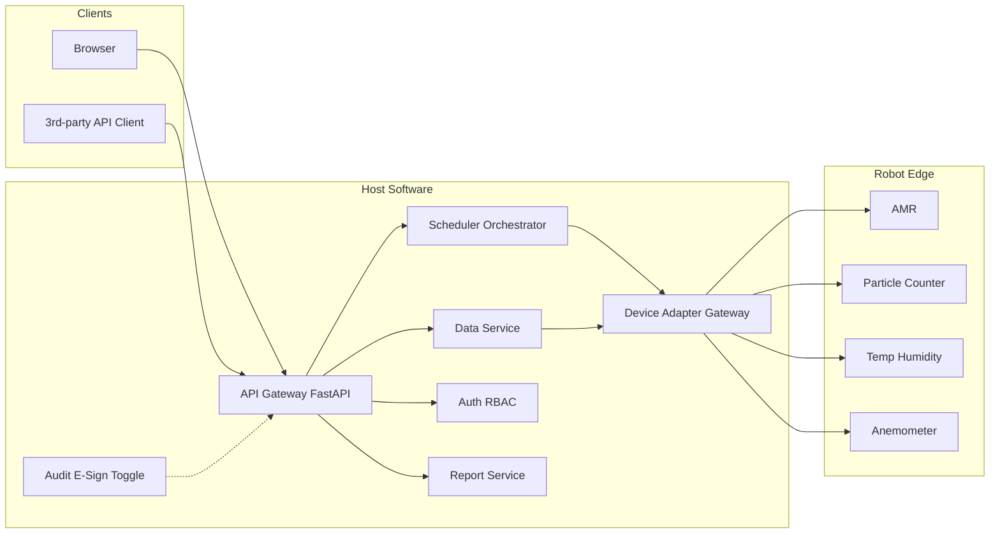

# 设计规范（DS）— 移动环境监测机器人系统

| 项 | 内容 |
|----|------|
| 文档编号 | MER-DS-001 |
| 版本 | V0.1 |
| 日期 | 2026-09-25 |
| 作者 | PM_Max |
| 状态 | Draft |
| 依据 | `doc/spec/urs.md`；`ref/requirement.md`；`spec/tech_stack.md`；`spec/interface_contracts.md`；`spec/security.md`；`spec/observability.md` |
| 关联方案 | `ref/project_scheme.md` |

---

## 1. 文档信息与设计目标

本 DS 将 URS 落实为可实施的架构与模块边界，指导上位机自研与 AMR/仪表适配。设计原则：

- 单体模块化，避免过早微服务。
- 业务只依赖抽象接口；设备/DB 经适配层。
- 配置外置（YAML）；密钥走环境变量。
- Fake/Simulator 一等公民，保障无硬件开发与 CI。
- 审计追踪与电子签名为**可开关**横切能力。

---

## 2. 系统上下文与部署视图

### 2.1 上下文（文字）

- **操作员/浏览器客户端** ↔ **上位机 API** ↔ **调度 / 数据 / 鉴权 / 报表 / 适配网关**
- **适配网关** ↔ **AMR API**、**粒子计数器**、**温湿度**、**风速**（扩展：浮游菌；远期：臂/深度相机）
- **可选**：第三方系统经 **对外 API** 调用
- **边端**（机器人工控/车载服务）：本地缓存、仪表直连、断点续传代理（实现形态 TBD：车载轻量代理 vs 上位机直连仪表）

### 2.2 部署（推荐）

```text
[Ubuntu 服务器]
  - mer-api (FastAPI)
  - mer-worker (可选：同进程或独立任务执行器)
  - PostgreSQL / SQLite(开发) + 时序存储(TBD: Timescale/独立表)
  - 反向代理 (Nginx) + TLS(TBD)
[现场 WiFi VLAN]
  - AMR × N + 充电桩
  - 仪表（经车载串口/网口）
[客户端]
  - 浏览器 (React/Vue)
```

### 2.3 可选 Mermaid



---

## 3. 逻辑架构

| 模块 | 职责 |
|------|------|
| API 层 | REST/OpenAPI、WebSocket/SSE 遥测推送、统一错误模型 |
| 鉴权与 RBAC | 用户/组/权限、会话、API Token |
| 调度编排 | 技能/任务/组合/集群状态机、资源占用、重试策略 |
| 数据服务 | 点位、时序监测数据、限值、查询聚合 |
| 报警事件 | 规则引擎（阈值比较）、生命周期、通知通道 |
| 报表 | 批报告生成与归档 |
| 适配网关 | 设备注册、适配器工厂、连接管理 |
| 审计/电子签名 | 开关、拦截器、签名挑战 |
| 备份 | 定时/手动备份与恢复作业 |
| 前端 | 地图、任务、看板、报警、配置、用户管理 |

边端（建议）：

- 与 AMR 厂商 SDK/API 共存；仪表 I/O 优先落在车载侧再经安全通道上报，以降低 WiFi 抖动对采样的影响（最终拓扑 **TBD**）。

---

## 4. 关键模块与接口边界

### 4.1 领域命令示例（适配层对外）

- `AmrAdapter`: `connect`, `get_status`, `navigate_to(pose|point_id)`, `cancel`, `dock_charge`, `subscribe_telemetry`
- `ParticleAdapter`: `start_sample(params)`, `stop_sample`, `read_channels`
- `ClimateAdapter`: `read_temp_humidity`
- `AirflowAdapter`: `read_air_speed`
- 扩展预留: `ViableAdapter`, `ArmAdapter`, `DepthCameraAdapter`

业务编排**禁止**直接出现 Modbus 寄存器、厂商私有帧。

### 4.2 HTTP API 约定

- OpenAPI 3.x；路径前缀如 `/api/v1/...`
- 错误体：`{ "code", "message", "retryable", "details?" }`
- 时间统一 ISO-8601（时区策略：存储 UTC，展示现场时区 — **TBD 确认**）
- 破坏性变更走 `/api/v2` 或特性开关

### 4.3 实时通道

- 推荐 WebSocket 或 SSE：机器人位姿、任务进度、报警
- 心跳与重连；服务端按订阅主题过滤

---

## 5. 数据模型概要

| 实体 | 关键字段（逻辑） |
|------|------------------|
| Robot | id, name, adapter_type, config_ref, status, last_pose, map_id |
| Map | id, name, source, layers_meta |
| Point / MonitoringSite | id, map_id, name, pose, instrument_profile, limits |
| SkillDef | id, type, params_schema |
| TaskDef / TaskInstance | 定义与实例；状态机；robot_id；skill 序列 |
| CompositeJob / ClusterJob | 子任务图；触发器（时间/事件） |
| Measurement | id, task_id, point_id, robot_id, metric, value, unit, ts, quality |
| Alarm | id, rule_id, severity, state, ack_by, ts |
| User / Group / Role | RBAC |
| AuditEvent | actor, action, object, before/after, ts, request_id |
| ESignRecord | user, meaning, object_ref, ts, method |
| Report | task_ref, file_uri, generated_at |
| BackupSet | uri, created_at, scope |

物理库：关系型为主；高频时序可用同一库分区表或 Timescale（**TBD**）。迁移版本化。

---

## 6. 任务 / 技能编排模型

```text
原子技能 Skill → 任务 Task（有序技能列表 + 失败策略）
              → 组合任务 Composite（任务图：顺序 / 等待时间 / 等待事件）
              → 集群 Cluster（多 Robot 绑定 + 同步屏障可选）
```

状态机（任务实例，示意）：`Created → Queued → Dispatched → Running → Succeeded | Failed | Cancelled`；支持暂停 **TBD**。

失败策略：技能级重试上限、整体失败回充/回待命点（可配置）。

幂等：下发带 `client_request_id`；设备动作需状态机保护避免重复采样。

---

## 7. 设备适配层设计

```text
config/devices.yaml
  → AdapterFactory
    → AmrXxxAdapter / AmrFake
    → ParticleYyyAdapter / ParticleFake
    → ...
DeviceRegistry（运行时健康、能力声明）
```

- 连接、心跳、超时、重连、编解码全部在适配器内。
- 坐标系与单位在适配器边界转换为领域单位（m、°C、%RH、m/s、counts）。
- 扩展浮游菌/臂：新增适配器 + YAML，不改调度核心。

**参考他厂，非本系统选型结论**：粒子仪通讯常见 RS485 + Modbus；温湿度需确认是否具备通讯（他厂曾遇无通讯型号不可用）。本系统选型 **TBD**。

---

## 8. 通信与实时

| 链路 | 设计要点 |
|------|----------|
| 现场 WiFi | 独立 SSID/VLAN 建议；强度与漫游由现场验收；指标 TBD |
| 指令/遥测 | 上位机 ↔ 边端/AMR API；QoS：指令需确认回执 |
| 断点续传 | 边端本地队列；条目含幂等键；恢复后批量上传 |
| 时钟 | NTP 同步要求写入部署手册（TBD） |

---

## 9. 安全与 Part 11 取向设计

| 能力 | 设计 |
|------|------|
| 认证 | 本地账号（MVP）；LDAP/OIDC 可选后期 |
| 授权 | RBAC；API 与 UI 共用权限码 |
| 审计开关 | `features.audit_trail: true/false`；中间件记录写操作与关键读（范围可配） |
| 电子签名开关 | `features.e_sign: true/false`；对绑定动作弹出再认证 + 签名含义 |
| 审计字段 | actor_id, action, object_type/id, payload_diff, ts, ip, request_id |
| 密钥 | `.env` / 密钥管理；禁止入库 |
| 默认 | 鉴权开启；审计/签名默认关或按客户模板 |

不声称已通过 Part 11 认证；制药试点需另开验证计划。

---

## 10. 多客户端与对外 API 策略

- **同一后端 API** 服务浏览器（MVP Must）、桌面/移动（Should/Could）。
- 浏览器：TypeScript + React 或 Vue（二选一，见技术栈落地）。
- 对外 API：独立 `api_client` 角色 + Token；限流与审计（若开启）；发布 OpenAPI 与变更日志。

---

## 11. 技术栈落地选择（本项目推荐）

对齐 `spec/tech_stack.md`：

| 层级 | 推荐 | 备注 |
|------|------|------|
| 语言 | Python 3.11+（后端）、TypeScript（前端） | |
| 后端框架 | FastAPI | OpenAPI 自然产出 |
| 前端 | React + Vite **或** Vue 3 + Vite | 立项时二选一锁定 |
| 包管理 | `uv`（Python）、`pnpm`/`npm`（前端） | |
| 配置 | YAML + 环境变量 | |
| 架构 | 单体模块化仓库（建议 monorepo：`backend/` `frontend/` `adapters/`） | |
| DB | PostgreSQL（生产）；SQLite 可开发 | 时序方案 TBD |
| 部署 | Ubuntu + systemd 或 Docker Compose | |
| 测试 | pytest + 前端单测；Fake 设备；HIL 标记 | |

目录建议见 `ref/project_scheme.md`。

---

## 12. 风险与待决设计点

| 项 | 说明 | 状态 |
|----|------|------|
| 边端 vs 直连仪表拓扑 | 影响断线缓存与实时性 | TBD |
| AMR 与电梯协议 | 跨层能否进 MVP | TBD |
| 多机交通管制 | 简单互斥 vs 完整 RMS | TBD |
| 地图格式 | 厂商专有 vs 标准化中间层 | TBD |
| 时序存储选型 | PG 表 vs Timescale vs 其他 | TBD |
| 风速采样高度 250 cm 级 | 固定杆 vs 升降 vs 臂 | TBD |
| 前端框架锁定 | React vs Vue | TBD |
| 电子签名法律效力与流程 | 客户 SOP | TBD |

---

## 13. 修订记录

| 版本 | 日期 | 说明 |
|------|------|------|
| V0.1 | 2026-09-25 | 初稿 |
