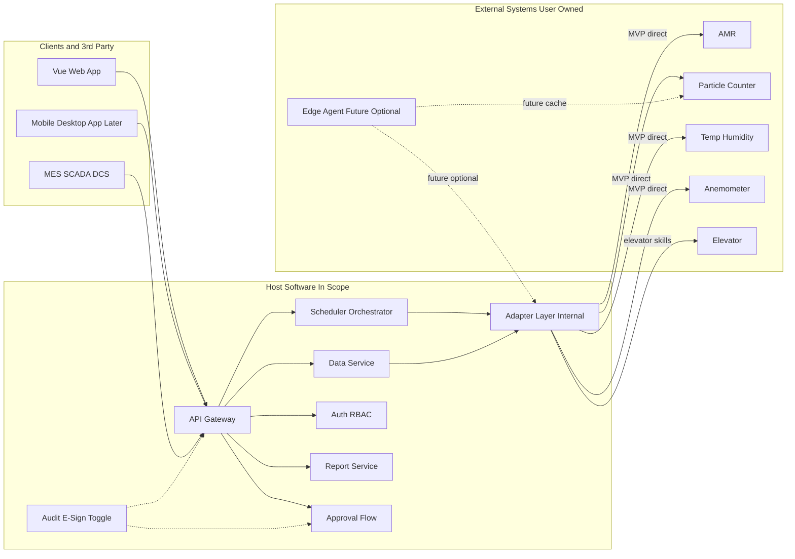

# 设计规范（DS）— 移动环境监测机器人上位机软件

| 项 | 内容 |
|----|------|
| 文档编号 | MER-DS-001 |
| 版本 | V0.3 |
| 日期 | 2026-09-25 |
| 作者 | PM_Max |
| 状态 | Draft |
| 范围 | **上位机软件架构与模块**；机器人/仪表为边界外 External Systems |
| 依据 | `doc/spec/urs.md` V0.3；`ref/requirement.md`；`spec/tech_stack.md`；`spec/interface_contracts.md`；`spec/security.md`；`spec/observability.md` |
| 关联方案 | `ref/project_scheme.md` |

---

## 1. 文档信息与设计目标

本 DS 将 URS（上位机范围）落实为可实施的软件架构与模块边界。设计原则：

- 单体模块化，避免过早微服务。
- 业务只依赖抽象接口；设备/DB 经适配层；**不绑定具体硬件品牌**。
- **对外**统一经 **API Gateway**；**对内**设备经适配层：**MVP 直连**；未来可扩展边端代理（须端侧缓存）。
- 配置外置（YAML）；密钥走环境变量。
- Fake/Simulator 一等公民，保障无硬件开发与 CI（含电梯 Fake）。
- 审计追踪与电子签名为**可开关**横切能力；**签名开启时强制批准流**。
- 多机 MVP：**简单互斥**（资源锁/区域互斥）；交通管制增强为演进项。
- 硬件选型、改装、现场基建由用户负责；本设计仅定义集成契约与软件模块。

---

## 2. 系统上下文与部署视图

### 2.1 上下文（对外 Gateway vs 对内适配）

- **操作员 / Vue Web / 后续桌面·移动客户端** ↔ **API Gateway** ↔ 调度 / 数据 / 鉴权 / 报表 / 批准流
- **第三方系统**（MES、SCADA、DCS 等）↔ **API Gateway**（常规操作、数据获取、设置类）
- **适配层（对内）** ↔ **External Systems**（用户选定的 AMR、粒子计数器、温湿度、风速；扩展浮游菌；远期臂/深度相机；电梯接口）
- **直连（MVP）**：仪表（及适用设备）**独立联网**，由适配层**直接通讯**，**不上边端代理**
- **边端代理（未来考虑）**：通俗=机器人本体/车载工控上的代理软件；**非 MVP**。若启用，**必须**实现端侧数据缓存（断网/弱网本地缓存，恢复后续传）

> **职责区分**：API Gateway = **对外**统一入口；适配层（及未来可选边端）= **对内**设备接入。二者不可混用或互相替代。
> **演进**：直连（MVP）→ 可选边端代理（含端侧缓存）；适配层接口预留代理模式，MVP 实现与验收以直连为准。

### 2.2 部署（软件在边界内）

```text
======== In Scope: Host Software ========
[Ubuntu 服务器]
  - mer-gateway / API Gateway（对外统一入口，OpenAPI）
  - mer-api / 领域服务（调度、数据、鉴权、报表、批准流）
  - mer-worker（可选：同进程或独立任务执行器）
  - mer-adapter-gateway（对内适配层）
  - PostgreSQL / SQLite(开发) + 时序存储(TBD)
  - 反向代理 (Nginx) + TLS(TBD)
[客户端]
  - Vue Web（TypeScript + Vue，MVP；已锁定）→ 经 API Gateway
  - 桌面/移动（分期）→ 经 API Gateway
==========================================

======== External Systems（用户负责）========
[现场网络 — 用户 IT]
  - AMR × N + 充电桩（硬件）
  - 仪表（MVP：独立联网 → 适配层直连；未来可选边端代理）
  - 电梯/楼控（硬件由用户负责；上位机提供技能+Fake）
==========================================
```

### 2.3 架构图（含 API Gateway）



---

## 3. 逻辑架构（分层）

| 层/模块 | 职责 |
|---------|------|
| **API Gateway（对外）** | 统一入口、鉴权、限流、OpenAPI、路由至领域服务；服务 MES/SCADA/DCS 与前端 App |
| API / 领域服务 | REST、WebSocket/SSE 遥测推送、统一错误模型 |
| 鉴权与 RBAC | 用户/组/权限、会话、API Token |
| 调度编排引擎 | 技能/任务/组合/集群状态机、**简单互斥**资源锁、重试策略；电梯技能纳入编排 |
| 数据服务 | 点位、时序监测数据、限值、查询聚合 |
| 报警事件 | 规则引擎（阈值比较）、生命周期、通知通道 |
| 报表 | 批报告生成与归档 |
| 批准流 | 与电子签名绑定；签名开启时强制；覆盖报告批准、限值变更等指定动作 |
| **适配层（对内）** | 设备注册、适配器工厂、连接管理；MVP 直连；预留未来边端代理模式 |
| 审计/电子签名 | 开关；开启签名 → 进入批准流 + 签名挑战 |
| 备份 | 定时/手动备份与恢复作业 |
| 前端 | 地图、任务、看板、报警、配置、用户管理（经 Gateway） |

**边端（通俗，未来）**：机器人本体/车载工控上的代理软件；与 Gateway 无关。**MVP 不上边端**。未来若采用，须含端侧数据缓存与续传。

**对内拓扑决议（MVP）**：仪表（及适用设备）独立联网，由上位机适配层**直接通讯**。演进路径：直连 → 可选边端代理（含端侧缓存）。适配层接口预留未来代理模式；**MVP 实现与验收以直连为准**（两种模式不对等默认）。

---

## 4. 关键模块与接口边界

### 4.1 适配器接口方法清单（不绑定品牌）

```text
AmrAdapter:
  connect() / disconnect()
  get_status() -> RobotStatus
  navigate_to(pose | point_id, options?) -> CommandHandle
  cancel(command_id?)
  dock_charge() -> CommandHandle
  subscribe_telemetry(callback) / unsubscribe
  # 电梯技能 — MVP 必须实现（含 Fake）
  call_elevator / enter_elevator / exit_elevator

ParticleAdapter:
  connect() / disconnect()
  start_sample(params) / stop_sample()
  read_channels() -> ChannelReading[]

ClimateAdapter:
  connect() / disconnect()
  read_temp_humidity() -> TempHumidityReading

AirflowAdapter:
  connect() / disconnect()
  read_air_speed() -> AirSpeedReading

# 扩展 / 远期占位
ViableAdapter, ArmAdapter, DepthCameraAdapter
```

公共约定：

- 生命周期：`start` / `stop` / `health`
- 错误：映射为领域错误（`retryable` 标记）
- 坐标系与单位在适配器边界转换为领域单位（m、°C、%RH、m/s、counts）
- 业务编排**禁止**直接出现厂商私有帧、寄存器地址
- 仪表拓扑：MVP 固定/默认 `access_mode: direct`；预留 `via_edge_agent`（未来，须端侧缓存）

### 4.2 API Gateway / OpenAPI

- 对外统一前缀 `/api/v1/...`（经 Gateway）
- OpenAPI 3.x；分组建议：`operations`（常规操作）、`data`（数据获取）、`settings`（设置类）
- 首批消费方：MES / SCADA / DCS 等第三方；Vue Web 及后续移动/桌面客户端
- 错误体：`{ "code", "message", "retryable", "details?" }`
- 时间：存储 UTC，展示现场时区（细则轻微 TBD）
- 破坏性变更走 `/api/v2` 或特性开关
- **禁止**客户端/第三方绕过 Gateway 直连适配器或内部服务

### 4.3 实时通道

- WebSocket 或 SSE：位姿、任务进度、报警（经 Gateway 或同源受控通道）
- 心跳与重连；按订阅主题过滤

---

## 5. 数据模型概要

| 实体 | 关键字段（逻辑） |
|------|------------------|
| Robot | id, name, adapter_type, config_ref, status, last_pose, map_id |
| Map | id, name, source, layers_meta |
| Point / MonitoringSite | id, map_id, name, pose, instrument_profile, limits |
| SkillDef | id, type, params_schema（含电梯技能） |
| TaskDef / TaskInstance | 定义与实例；状态机；robot_id；skill 序列 |
| CompositeJob / ClusterJob | 子任务图；触发器（时间/事件） |
| ResourceLock | resource_type/id, holder, expires_at（MVP 简单互斥） |
| Measurement | id, task_id, point_id, robot_id, metric, value, unit, ts, quality |
| Alarm | id, rule_id, severity, state, ack_by, ts |
| User / Group / Role | RBAC |
| AuditEvent | actor, action, object, before/after, ts, request_id |
| ESignRecord | user, meaning, object_ref, ts, method |
| ApprovalRequest / ApprovalStep | 与 ESign 绑定；object_ref, state, approvers |
| Report | task_ref, file_uri, generated_at |
| BackupSet | uri, created_at, scope |
| DeviceConfig | YAML；含 access_mode、adapter_type |

物理库：关系型为主；高频时序可用分区表或 Timescale（**轻微 TBD**）。迁移版本化。

---

## 6. 任务 / 技能编排模型

```text
原子技能 Skill → 任务 Task（有序技能列表 + 失败策略）
              → 组合任务 Composite（顺序 / 等待时间 / 等待事件）
              → 集群 Cluster（多 Robot 绑定 + 同步屏障可选）
```

状态机（示意）：`Created → Queued → Dispatched → Running → Succeeded | Failed | Cancelled`；暂停为轻微 TBD。

**资源互斥（MVP）**：点位、电梯、充电桩等逻辑资源用锁/区域互斥；冲突时排队或失败可配置。

**演进路径**：MVP 简单互斥 → 扩展阶段增强交通管制（路径预约/优先级/死锁检测等，算法形态后续定）→ 远期更优车队算法。

失败策略：技能级重试上限、失败回充/回待命点（可配置）。

幂等：下发带 `client_request_id`；设备动作需状态机保护避免重复采样。

**电梯**：Call/Enter/Exit 纳入 MVP 编排技能目录；Fake 必须可演；真机依赖用户电梯就绪。

---

## 7. 设备适配层设计（对内）

```text
config/devices.yaml
  → AdapterFactory（按 type 装配，型号字段配置驱动）
    → AmrFake / AmrGenericHttp / AmrVendorX（用户提供文档后实现）
    → ParticleFake / ParticleModbusGeneric / ...
    → ElevatorFake / ElevatorVendorX
DeviceRegistry（健康、能力声明）
access_mode: direct  # MVP；预留 via_edge_agent（未来）
```

- 连接、心跳、超时、重连、编解码全部在适配器内。
- 扩展浮游菌/臂：新增适配器 + YAML，不改调度核心。
- **不在本 DS 中给出硬件选型或品牌结论。**

---

## 8. 通信与实时（软件视角）

| 链路 | 设计要点 |
|------|----------|
| 对外 | 客户端/第三方 → API Gateway |
| 指令/遥测（对内） | MVP：适配层 ↔ AMR/直连仪表；指令需确认回执 |
| 断点续传 | MVP：上位机/适配层侧重试与幂等接收；未来边端须端侧缓存后续传 |
| 时钟 | NTP 要求写入部署手册（轻微 TBD） |
| 现场 WiFi | 外部依赖；软件侧实现超时、重连、离线事件 |

---

## 9. 安全、电子签名与批准流

| 能力 | 设计 |
|------|------|
| 认证 | 本地账号（MVP）；LDAP/OIDC 可选后期 |
| 授权 | RBAC；API 与 UI 共用权限码；Gateway 强制鉴权 |
| 审计开关 | `features.audit_trail: true/false` |
| 电子签名开关 | `features.e_sign: true/false`；**建议默认 false**（建议，非硬性） |
| 签名与批准流 | **e_sign=true 时强制进入批准流**；签名意图 + 身份再确认 + 审批步骤完成后动作方生效 |
| 典型绑定动作 | 报告批准、限值变更等（可配置扩展） |
| 审计字段 | actor_id, action, object_type/id, payload_diff, ts, ip, request_id |
| 密钥 | `.env` / 密钥管理；禁止入库 |
| 默认 | 鉴权开启；审计/签名建议默认关；按客户/现场开启 |

不声称已通过 Part 11 认证。

---

## 10. 多客户端与对外 API

- **API Gateway** 为唯一对外入口；同一契约服务 Vue Web（MVP Must）、桌面/移动（分期）、MES/SCADA/DCS。
- 浏览器：Vue Web（MVP），技术栈为 TypeScript + Vue；本项目已锁定 Vue。
- 能力范围：常规操作、数据获取、设置类；`api_client` 角色 + Token；限流；OpenAPI 与变更日志。

---

## 11. 技术栈落地（推荐）

对齐 `spec/tech_stack.md`（本项目前端选型覆盖默认规范；**不修改** `spec/tech_stack.md` 全局默认文件）：

| 层级 | 推荐 | 备注 |
|------|------|------|
| 语言 | Python 3.11+（后端）、TypeScript（前端） | |
| 后端框架 | FastAPI | OpenAPI 自然产出；Gateway 可同进程模块或前置 |
| 前端 | Vue 3 + Vite（TypeScript + Vue） | **本项目已锁定 Vue** |
| 包管理 | `uv`（Python）、`pnpm`/`npm`（前端） | |
| 配置 | YAML + 环境变量 | |
| 架构 | 单体模块化（`backend/` `frontend/` `adapters/`） | Gateway 与 Adapter 分层清晰 |
| DB | PostgreSQL（生产）；SQLite 可开发 | 时序方案轻微 TBD |
| 部署 | Ubuntu + systemd 或 Docker Compose | |
| 测试 | pytest + 前端单测；Fake（含电梯）；HIL 标记跳过 | |

目录建议见 `ref/project_scheme.md`。

---

## 12. 风险与设计点状态（上位机）

| 项 | 说明 | 状态 |
|----|------|------|
| 边端代理 vs 直连仪表 | MVP=直连（不上边端）；未来可选边端（须端侧缓存）；接口预留 | **已决议** |
| 电梯接口是否进 MVP | 软件技能 + Fake 纳入 MVP 验收；真机依赖用户 | **已决议** |
| 多机交通管制深度 | MVP 简单互斥；增强为演进路径 | **已决议** |
| API Gateway 与首批对接 | Gateway 必须；MES/SCADA/DCS + 前端 App；操作/数据/设置 | **已决议** |
| 电子签名批准流 | 可开/关；开启强制批准流；建议默认关 | **已决议** |
| 前端框架 | TypeScript + Vue（Vue Web，MVP） | **已决议** |
| 地图中间表示 | 厂商专有 → 标准化显示层 | 轻微 TBD |
| 时序存储选型 | PG 表 vs Timescale | 轻微 TBD |
| 用户设备 API 就绪时间 | 阻塞真机联调，不阻塞 Fake 主路径 | 外部依赖 |

---

## 13. 修订记录

| 版本 | 日期 | 说明 |
|------|------|------|
| V0.1 | 2026-09-25 | 初稿 |
| V0.2 | 2026-09-25 | 改为上位机软件架构；外部系统边界化；适配器接口清单强化；去掉硬件选型表述 |
| V0.2.1 | 2026-09-25 | 用户确认上位机前端锁定 Vue（TypeScript + Vue）；客户端与技术栈表述落地 |
| V0.3 | 2026-09-25 | 架构图加入 API Gateway；对内适配 vs 对外 Gateway；签名+批准流；电梯 MVP；简单互斥与演进；边端/直连定义与 MVP 拓扑；关闭多项 TBD |
