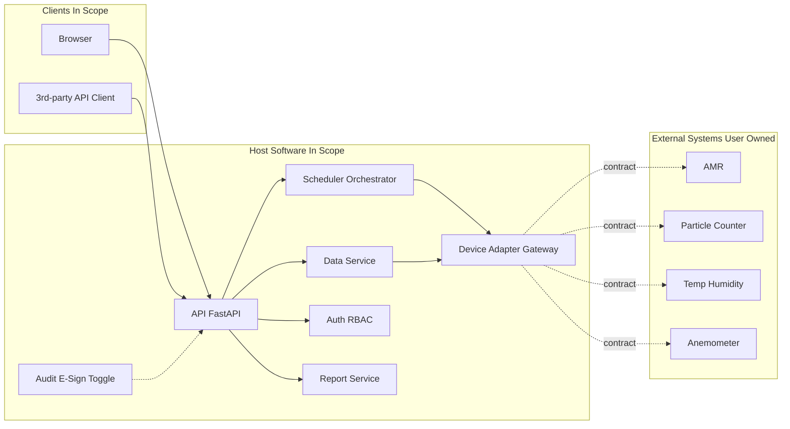

# 设计规范（DS）— 移动环境监测机器人上位机软件

| 项 | 内容 |
|----|------|
| 文档编号 | MER-DS-001 |
| 版本 | V0.2.1 |
| 日期 | 2026-09-25 |
| 作者 | PM_Max |
| 状态 | Draft |
| 范围 | **上位机软件架构与模块**；机器人/仪表为边界外 External Systems |
| 依据 | `doc/spec/urs.md` V0.2；`ref/requirement.md`；`spec/tech_stack.md`；`spec/interface_contracts.md`；`spec/security.md`；`spec/observability.md` |
| 关联方案 | `ref/project_scheme.md` |

---

## 1. 文档信息与设计目标

本 DS 将 URS（上位机范围）落实为可实施的软件架构与模块边界。设计原则：

- 单体模块化，避免过早微服务。
- 业务只依赖抽象接口；设备/DB 经适配层；**不绑定具体硬件品牌**。
- 配置外置（YAML）；密钥走环境变量。
- Fake/Simulator 一等公民，保障无硬件开发与 CI。
- 审计追踪与电子签名为**可开关**横切能力。
- 硬件选型、改装、现场基建由用户负责；本设计仅定义集成契约与软件模块。

---

## 2. 系统上下文与部署视图

### 2.1 上下文

- **操作员 / 浏览器客户端** ↔ **上位机 API** ↔ **调度 / 数据 / 鉴权 / 报表 / 适配网关**
- **适配网关** ↔ **External Systems**（用户选定的 AMR、粒子计数器、温湿度、风速；扩展浮游菌；远期臂/深度相机）
- **可选**：第三方系统经 **对外 API** 调用
- **边端代理（可选软件组件）**：本地缓存、仪表直连、断点续传 — 拓扑 TBD（边端代理 vs 上位机直连）

### 2.2 部署（软件在边界内）

```text
======== In Scope: Host Software ========
[Ubuntu 服务器]
  - mer-api (FastAPI)
  - mer-worker (可选：同进程或独立任务执行器)
  - PostgreSQL / SQLite(开发) + 时序存储(TBD)
  - 反向代理 (Nginx) + TLS(TBD)
[客户端]
  - Vue Web（TypeScript + Vue，MVP；已锁定）
  - 桌面/移动（分期）
==========================================

======== External Systems（用户负责）========
[现场网络 — 用户 IT]
  - AMR × N + 充电桩（硬件）
  - 仪表（经车载串口/网口 — 硬件）
  - 电梯/楼控（若启用）
==========================================
```

### 2.3 可选 Mermaid



---

## 3. 逻辑架构（分层）

| 层/模块 | 职责 |
|---------|------|
| API 层 | REST/OpenAPI、WebSocket/SSE 遥测推送、统一错误模型 |
| 鉴权与 RBAC | 用户/组/权限、会话、API Token |
| 调度编排引擎 | 技能/任务/组合/集群状态机、资源占用、重试策略 |
| 数据服务 | 点位、时序监测数据、限值、查询聚合 |
| 报警事件 | 规则引擎（阈值比较）、生命周期、通知通道 |
| 报表 | 批报告生成与归档 |
| 适配网关 | 设备注册、适配器工厂、连接管理、契约实现切换 |
| 审计/电子签名 | 开关、拦截器、签名挑战 |
| 备份 | 定时/手动备份与恢复作业 |
| 前端 | 地图、任务、看板、报警、配置、用户管理 |

边端代理（若采用）：作为可选部署单元，实现本地队列与仪表 I/O；与核心编排经安全通道通信。最终拓扑 **TBD**。

---

## 4. 关键模块与接口边界

### 4.1 适配器接口方法清单（不绑定品牌）

```text
AmrAdapter:
  connect() / disconnect()
  get_status() -> RobotStatus
  navigate_to(pose | point_id, options?) -> CommandHandle
  cancel(command_id?)
  dock_charge() -> CommandHandle
  subscribe_telemetry(callback) / unsubscribe
  # 可选电梯技能（若契约启用）
  call_elevator / enter_elevator / exit_elevator

ParticleAdapter:
  connect() / disconnect()
  start_sample(params) / stop_sample()
  read_channels() -> ChannelReading[]

ClimateAdapter:
  connect() / disconnect()
  read_temp_humidity() -> TempHumidityReading

AirflowAdapter:
  connect() / disconnect()
  read_air_speed() -> AirSpeedReading

# 扩展 / 远期占位
ViableAdapter, ArmAdapter, DepthCameraAdapter
```

公共约定：

- 生命周期：`start` / `stop` / `health`
- 错误：映射为领域错误（`retryable` 标记）
- 坐标系与单位在适配器边界转换为领域单位（m、°C、%RH、m/s、counts）
- 业务编排**禁止**直接出现厂商私有帧、寄存器地址

### 4.2 HTTP API / OpenAPI

- OpenAPI 3.x；路径前缀 `/api/v1/...`
- 错误体：`{ "code", "message", "retryable", "details?" }`
- 时间：存储 UTC，展示现场时区（确认 TBD）
- 破坏性变更走 `/api/v2` 或特性开关

### 4.3 实时通道

- WebSocket 或 SSE：位姿、任务进度、报警
- 心跳与重连；按订阅主题过滤

---

## 5. 数据模型概要

| 实体 | 关键字段（逻辑） |
|------|------------------|
| Robot | id, name, adapter_type, config_ref, status, last_pose, map_id |
| Map | id, name, source, layers_meta |
| Point / MonitoringSite | id, map_id, name, pose, instrument_profile, limits |
| SkillDef | id, type, params_schema |
| TaskDef / TaskInstance | 定义与实例；状态机；robot_id；skill 序列 |
| CompositeJob / ClusterJob | 子任务图；触发器（时间/事件） |
| Measurement | id, task_id, point_id, robot_id, metric, value, unit, ts, quality |
| Alarm | id, rule_id, severity, state, ack_by, ts |
| User / Group / Role | RBAC |
| AuditEvent | actor, action, object, before/after, ts, request_id |
| ESignRecord | user, meaning, object_ref, ts, method |
| Report | task_ref, file_uri, generated_at |
| BackupSet | uri, created_at, scope |
| DeviceConfig | YAML 驱动的适配器装配元数据 |

物理库：关系型为主；高频时序可用分区表或 Timescale（**TBD**）。迁移版本化。

---

## 6. 任务 / 技能编排模型

```text
原子技能 Skill → 任务 Task（有序技能列表 + 失败策略）
              → 组合任务 Composite（顺序 / 等待时间 / 等待事件）
              → 集群 Cluster（多 Robot 绑定 + 同步屏障可选）
```

状态机（示意）：`Created → Queued → Dispatched → Running → Succeeded | Failed | Cancelled`；暂停 **TBD**。

失败策略：技能级重试上限、失败回充/回待命点（可配置）。

幂等：下发带 `client_request_id`；设备动作需状态机保护避免重复采样。

---

## 7. 设备适配层设计

```text
config/devices.yaml
  → AdapterFactory（按 type 装配，型号字段配置驱动）
    → AmrFake / AmrGenericHttp / AmrVendorX（用户提供文档后实现）
    → ParticleFake / ParticleModbusGeneric / ...
DeviceRegistry（健康、能力声明）
```

- 连接、心跳、超时、重连、编解码全部在适配器内。
- 扩展浮游菌/臂：新增适配器 + YAML，不改调度核心。
- **不在本 DS 中给出硬件选型或品牌结论。**

---

## 8. 通信与实时（软件视角）

| 链路 | 设计要点 |
|------|----------|
| 指令/遥测 | 上位机 ↔ 边端/AMR API；指令需确认回执 |
| 断点续传 | 边端或网关本地队列；幂等键 Upsert 至数据服务 |
| 时钟 | NTP 要求写入部署手册（TBD） |
| 现场 WiFi | 外部依赖；软件侧实现超时、重连、离线事件 |

---

## 9. 安全与 Part 11 取向

| 能力 | 设计 |
|------|------|
| 认证 | 本地账号（MVP）；LDAP/OIDC 可选后期 |
| 授权 | RBAC；API 与 UI 共用权限码 |
| 审计开关 | `features.audit_trail: true/false` |
| 电子签名开关 | `features.e_sign: true/false`；再认证 + 签名含义 |
| 审计字段 | actor_id, action, object_type/id, payload_diff, ts, ip, request_id |
| 密钥 | `.env` / 密钥管理；禁止入库 |
| 默认 | 鉴权开启；审计/签名默认关或按客户模板 |

不声称已通过 Part 11 认证。

---

## 10. 多客户端与对外 API

- 同一后端 API 服务浏览器（MVP Must）、桌面/移动（分期）。
- 浏览器：Vue Web（MVP），技术栈为 TypeScript + Vue；本项目已锁定 Vue。
- 对外 API：`api_client` 角色 + Token；限流；OpenAPI 与变更日志。

---

## 11. 技术栈落地（推荐）

对齐 `spec/tech_stack.md`：

| 层级 | 推荐 | 备注 |
|------|------|------|
| 语言 | Python 3.11+（后端）、TypeScript（前端） | |
| 后端框架 | FastAPI | OpenAPI 自然产出 |
| 前端 | Vue 3 + Vite（TypeScript + Vue） | **本项目已锁定 Vue；覆盖默认规范的前端选型** |
| 包管理 | `uv`（Python）、`pnpm`/`npm`（前端） | |
| 配置 | YAML + 环境变量 | |
| 架构 | 单体模块化（`backend/` `frontend/` `adapters/`） | |
| DB | PostgreSQL（生产）；SQLite 可开发 | 时序方案 TBD |
| 部署 | Ubuntu + systemd 或 Docker Compose | |
| 测试 | pytest + 前端单测；Fake；HIL 标记跳过 | |

目录建议见 `ref/project_scheme.md`。

---

## 12. 风险与待决设计点（上位机）

| 项 | 说明 | 状态 |
|----|------|------|
| 边端代理 vs 直连仪表 | 影响续传与适配部署形态 | TBD |
| 电梯接口是否进 MVP 验收 | 技能可先做，真机门禁可豁免 | TBD |
| 多机交通管制深度 | 简单互斥 vs 更完整策略 | TBD |
| 地图中间表示 | 厂商专有 → 标准化显示层 | TBD |
| 时序存储选型 | PG 表 vs Timescale | TBD |
| 前端框架 | TypeScript + Vue（Vue Web，MVP） | 已决议 |
| 电子签名批准流 | 客户 SOP | TBD |
| 用户设备 API 就绪时间 | 阻塞真机联调，不阻塞 Fake 主路径 | 外部依赖 |

---

## 13. 修订记录

| 版本 | 日期 | 说明 |
|------|------|------|
| V0.1 | 2026-09-25 | 初稿 |
| V0.2 | 2026-09-25 | 改为上位机软件架构；外部系统边界化；适配器接口清单强化；去掉硬件选型表述 |

| V0.2.1 | 2026-09-25 | 用户确认上位机前端锁定 Vue（TypeScript + Vue）；客户端与技术栈表述落地 |
